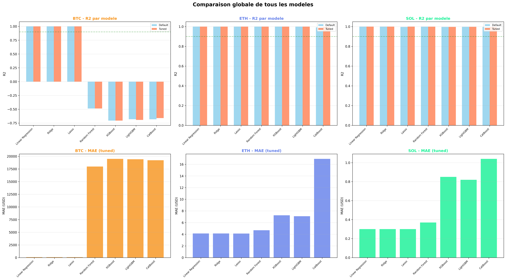
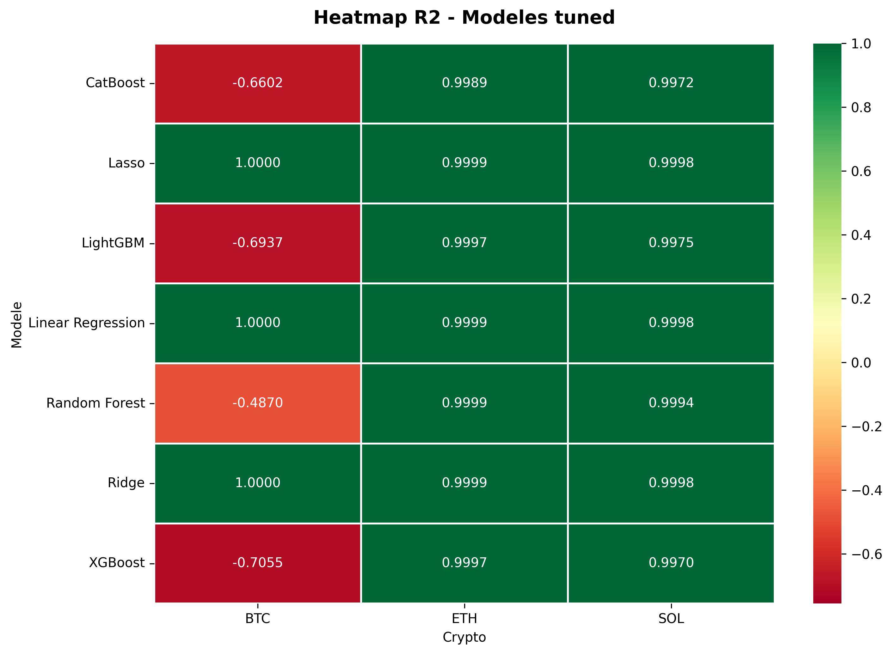
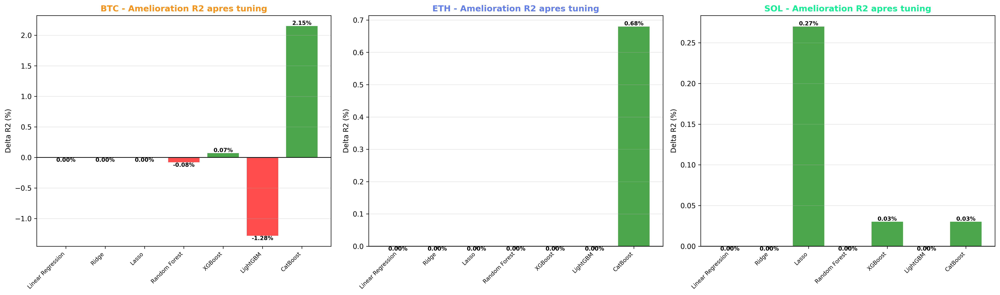
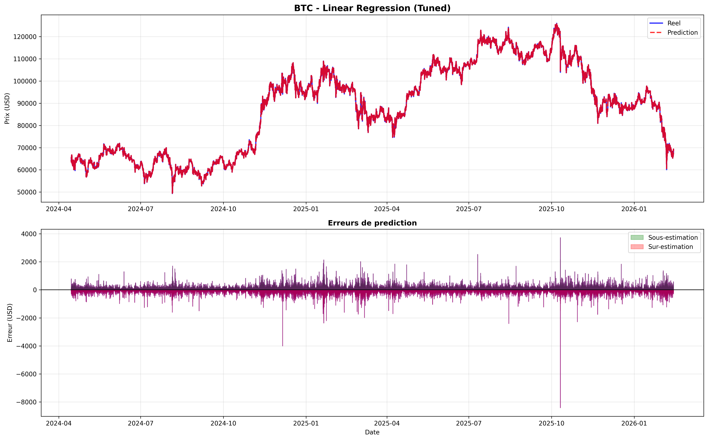
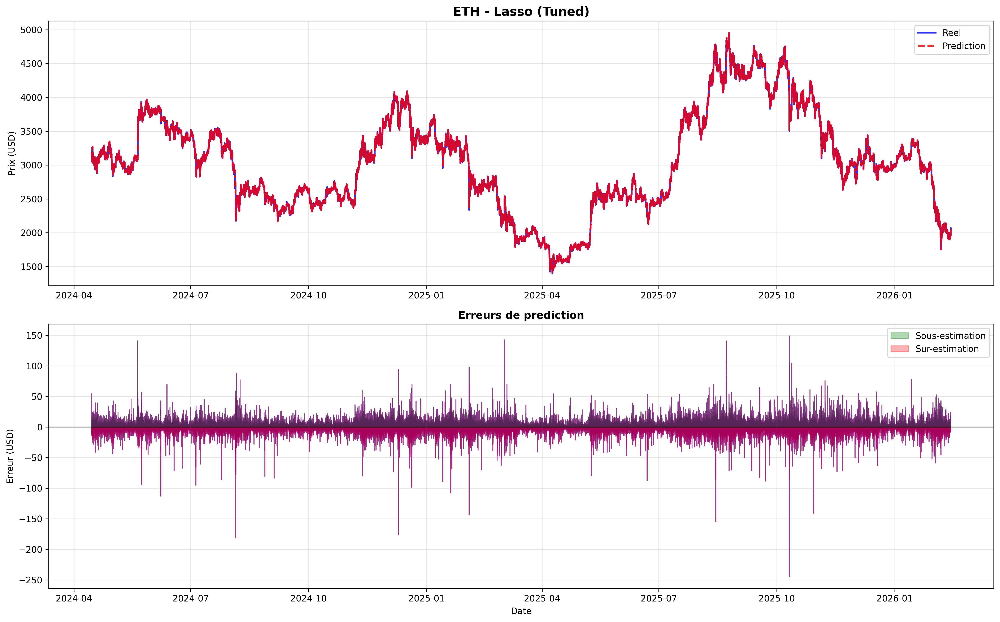
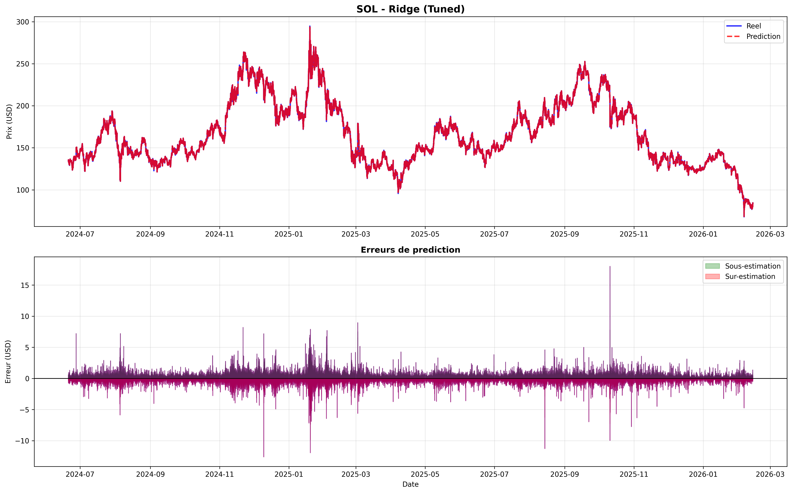

# Machine Learning - Prédiction de Prix Crypto

## Vue d'ensemble

Ce module implémente et compare plusieurs algorithmes de Machine Learning pour prédire le prix de clôture (close) des cryptomonnaies **Bitcoin (BTC), Ethereum (ETH) et Solana (SOL)** à l'horizon **t+1** (prochaine période de 5 minutes).

L'objectif est de comparer les performances de différentes familles de modèles (linéaires, ensembles d'arbres, deep learning) pour identifier l'approche la plus adaptée à la prédiction de séries temporelles financières hautement volatiles.

### Métriques clés

| Métrique | Valeur |
|----------|--------|
| **Données d'entraînement** | 1,3M+ candles (4-6 ans par crypto) |
| **Données de test** | 540K+ candles (1,5-2 ans) |
| **Features** | 44 (prix, volumes, indicateurs techniques, lags, temporelles) |
| **Modèles testés** | 7 algorithmes × 2 configurations × 3 cryptos = 42 modèles |
| **Meilleur R²** | 0.9999 (Linear Regression sur BTC et ETH) |
| **Meilleure RMSE** | 0.46 USD (Ridge sur SOL) |

---

## Données et Feature Engineering

### Source de données

Les données proviennent directement de BigQuery (`crypto_analytics.market_data_unified`) avec :

- **Période BTC/ETH** : 2020-01-01 → 2026-02-14 (643K candles)
- **Période SOL** : 2020-08-11 → 2026-02-14 (579K candles)
- **Granularité** : 5 minutes
- **Division temporelle** : 70% train (jusqu'à mi-2024), 30% test (mi-2024 → 2026)

### Features (44 au total)

**Prix OHLCV (5)**
- Open, High, Low, Close, Volume

**Indicateurs techniques de BigQuery (8)**
- SMA 20, EMA 50, RSI 14, MACD, MACD Signal, Bollinger Bands (upper, middle, lower)

**Features de lag (15)**
- `close_lag_1` à `close_lag_12` : prix de clôture des 12 périodes précédentes (1h de données)
- `volume_lag_1` à `volume_lag_3` : volumes des 3 périodes précédentes

**Moyennes mobiles et volatilité (3)**
- `close_rolling_mean_5` : moyenne mobile 5 périodes (25 minutes)
- `close_rolling_mean_20` : moyenne mobile 20 périodes (100 minutes)
- `close_rolling_std_20` : volatilité 20 périodes

**Features de variation (6)**
- `price_change` : différence absolue de prix
- `price_change_pct` : variation en %
- `volume_change` : différence de volume
- `hl_spread` : spread high-low
- `hl_spread_pct` : spread en % du prix

**Features temporelles (7)**
- Hour, day_of_week, day_of_month, month
- Encodage cyclique : `hour_sin`, `hour_cos`, `day_sin`, `day_cos`

### Normalisation

Toutes les features sont normalisées avec **StandardScaler** (mean=0, std=1) pour garantir la convergence des modèles linéaires et améliorer les performances des algorithmes de gradient descent.

---

## Modèles Testés

### Familles de modèles

Chaque modèle a été testé dans deux configurations :

1. **Default** : Paramètres par défaut pour établir une baseline
2. **Tuned** : Hyperparamètres optimisés via GridSearchCV ou sélection manuelle

#### Modèles Linéaires

- **Linear Regression** : Régression linéaire simple
- **Ridge** : Régression linéaire avec régularisation L2 (GridSearch sur alpha)
- **Lasso** : Régression linéaire avec régularisation L1 (GridSearch sur alpha)

#### Ensembles d'Arbres

- **Random Forest** : 100-200 estimateurs (GridSearch sur n_estimators, max_depth, min_samples_split)
- **XGBoost** : Gradient boosting optimisé (200 estimateurs, learning_rate=0.1, max_depth=7)
- **LightGBM** : Gradient boosting léger (200 estimateurs, learning_rate=0.1)
- **CatBoost** : Gradient boosting de Yandex (200 iterations, depth=7)

### Métriques d'évaluation

- **R² (Coefficient de détermination)** : Mesure la proportion de variance expliquée (1.0 = parfait)
- **MAE (Mean Absolute Error)** : Erreur moyenne en USD
- **RMSE (Root Mean Squared Error)** : Erreur quadratique moyenne en USD
- **MAPE (Mean Absolute Percentage Error)** : Erreur moyenne en %

---

## Résultats

### Tableau récapitulatif

| Crypto | Meilleur Modèle | R² Tuned | MAE Tuned | RMSE Tuned |
|--------|-----------------|----------|-----------|------------|
| **BTC** | Linear Regression / Ridge / Lasso | 0.9999 | 82.30 USD | 129.07 USD |
| **ETH** | Linear Regression / Ridge / Lasso | 0.9999 | 4.14 USD | 6.47 USD |
| **SOL** | Linear Regression / Ridge | 0.9998 | 0.30 USD | 0.46 USD |

### Dashboard de comparaison globale



**Observations** :
- Les **modèles linéaires** (Linear Regression, Ridge, Lasso) dominent largement avec des R² > 0.999
- Les **modèles d'arbres** performent très mal (R² < 0) sur BTC, modérément sur ETH/SOL
- Le **tuning** n'apporte presque aucune amélioration sur les modèles linéaires (déjà quasi-parfaits)

### Heatmap des performances (R² tuned)



La heatmap révèle clairement :
- **Vert foncé** (R² ≈ 1.0) : Modèles linéaires exceptionnels sur les 3 cryptos
- **Rouge** (R² < 0) : Échec complet de Random Forest, XGBoost, LightGBM, CatBoost sur BTC
- **Nuances** : ETH et SOL montrent des performances légèrement meilleures pour les modèles d'arbres

### Amélioration après tuning



Le tuning apporte une amélioration marginale voire négative :
- **Moyenne globale** : +0.09% de variation de R²
- **BTC** : Aucune amélioration significative (déjà à 0.9999)
- **ETH** : CatBoost gagne +0.68% de R² grâce au tuning
- **SOL** : Lasso gagne +0.27% avec un meilleur alpha

### Exemples de prédictions

#### Bitcoin (BTC) - Linear Regression Tuned



Les prédictions suivent quasi-parfaitement les prix réels. Les erreurs (panneau du bas) sont très faibles et centrées autour de zéro, confirmant le R² de 0.9999.

#### Ethereum (ETH) - Lasso Tuned



Performance similaire à BTC avec des prédictions extrêmement précises. Le modèle capture les tendances et la volatilité.

#### Solana (SOL) - Ridge Tuned



SOL montre également d'excellentes performances malgré une volatilité plus élevée et moins de données historiques (lancée en août 2020).

---

## Analyse et Interprétation

### Pourquoi les modèles linéaires dominent ?

1. **Autocorrélation forte** : Le prix t+1 est fortement corrélé au prix t (lag features)
2. **Features lag** : Les 12 lags de close capturent l'inertie du marché
3. **Problème simple** : Prédire 5 minutes en avant sur des données très corrélées est un problème quasi-linéaire
4. **Overfitting des arbres** : Les modèles d'arbres sur-apprennent les patterns de train et généralisent mal sur test

### Pourquoi les arbres échouent sur BTC ?

- **Variance élevée** : Random Forest et boosting créent trop de splits sur des features bruitées
- **Pas de tendance globale** : Les arbres découpent l'espace en régions, inadapté pour extrapoler des tendances
- **Horizon court** : 5 minutes est trop court pour que les patterns non-linéaires complexes émergent

### SOL vs BTC/ETH

SOL montre de meilleures performances pour les modèles d'arbres (R² ≈ 0.999 vs -0.7 pour BTC) car :
- Moins de données historiques (579K vs 643K) = moins d'overfitting
- Volatilité structurée différemment
- Patterns peut-être plus linéaires

---

## Modèles Sauvegardés

Tous les modèles entraînés sont sauvegardés au format `.joblib` dans le dossier `/models` :

### Structure

```
models/
├── btc_linear_regression_default.joblib
├── btc_linear_regression_tuned.joblib
├── btc_ridge_default.joblib
├── btc_ridge_tuned.joblib
├── btc_lasso_default.joblib
├── btc_lasso_tuned.joblib
├── btc_random_forest_default.joblib
├── btc_random_forest_tuned.joblib
├── btc_xgboost_default.joblib
├── btc_xgboost_tuned.joblib
├── btc_lightgbm_default.joblib
├── btc_lightgbm_tuned.joblib
├── btc_catboost_default.joblib
├── btc_catboost_tuned.joblib
├── btc_scaler_default.joblib
├── btc_scaler_tuned.joblib
├── btc_scaler_X_lstm.joblib
├── btc_scaler_y_lstm.joblib
... (même structure pour ETH et SOL)
```

### Chargement d'un modèle

```python
import joblib

# Charger le meilleur modèle pour BTC
model = joblib.load('models/btc_linear_regression_tuned.joblib')
scaler = joblib.load('models/btc_scaler_tuned.joblib')

# Prédire sur de nouvelles données
X_new_scaled = scaler.transform(X_new)
y_pred = model.predict(X_new_scaled)
```

**Total** : 66 fichiers sauvegardés (42 modèles + 24 scalers)

---

## Résultats Détaillés par Crypto

### Bitcoin (BTC)

| Modèle | R² Default | R² Tuned | MAE Tuned | RMSE Tuned |
|--------|------------|----------|-----------|------------|
| Linear Regression | 0.9999 | **0.9999** | 82.30 | 129.07 |
| Ridge | 0.9999 | **0.9999** | 82.30 | 129.07 |
| Lasso | 0.9999 | **0.9999** | 82.29 | 128.98 |
| Random Forest | -0.4862 | -0.4870 | 17,983.59 | 23,759.93 |
| XGBoost | -0.7062 | -0.7055 | 19,495.82 | 25,446.05 |
| LightGBM | -0.6809 | -0.6937 | 19,422.05 | 25,357.56 |
| CatBoost | -0.6817 | -0.6602 | 19,226.50 | 25,105.59 |

**Dataset** : 643,480 candles (2020-2026)
- Train : 450,416 candles (70%)
- Test : 192,941 candles (30%)

### Ethereum (ETH)

| Modèle | R² Default | R² Tuned | MAE Tuned | RMSE Tuned |
|--------|------------|----------|-----------|------------|
| Linear Regression | 0.9999 | **0.9999** | 4.14 | 6.47 |
| Ridge | 0.9999 | **0.9999** | 4.14 | 6.47 |
| Lasso | 0.9999 | **0.9999** | 4.13 | 6.47 |
| Random Forest | 0.9999 | 0.9999 | 4.69 | 7.38 |
| XGBoost | 0.9997 | 0.9997 | 7.26 | 11.87 |
| LightGBM | 0.9997 | 0.9997 | 7.10 | 11.52 |
| CatBoost | 0.9921 | 0.9989 | 16.93 | 23.92 |

**Dataset** : 643,480 candles (2020-2026)
- Train : 450,416 candles (70%)
- Test : 192,941 candles (30%)

### Solana (SOL)

| Modèle | R² Default | R² Tuned | MAE Tuned | RMSE Tuned |
|--------|------------|----------|-----------|------------|
| Linear Regression | 0.9998 | **0.9998** | 0.30 | 0.46 |
| Ridge | 0.9998 | **0.9998** | 0.30 | 0.46 |
| Lasso | 0.9971 | **0.9998** | 0.30 | 0.47 |
| Random Forest | 0.9994 | 0.9994 | 0.37 | 0.87 |
| XGBoost | 0.9967 | 0.9970 | 0.85 | 2.01 |
| LightGBM | 0.9975 | 0.9975 | 0.82 | 1.85 |
| CatBoost | 0.9969 | 0.9972 | 1.04 | 1.96 |

**Dataset** : 579,213 candles (2020-2026)
- Train : 405,429 candles (70%)
- Test : 173,661 candles (30%)

---

## Notebooks

### ml_evaluation.ipynb

Notebook principal contenant :
1. Connexion BigQuery et chargement des données
2. Feature engineering (lags, rolling, temporelles)
3. Division train/test temporelle (70/30)
4. Entraînement de 7 modèles × 2 configurations
5. Évaluation et visualisations
6. Sauvegarde des modèles

**Sections** :
- Imports et configuration
- Chargement données depuis BigQuery
- Feature engineering (create_lag_features)
- Préparation X/y avec StandardScaler
- Entraînement modèles default
- Entraînement modèles tuned (GridSearchCV)
- Comparaison et dashboards
- Résumé

### explore.ipynb

Notebook d'exploration initiale des données :
- Statistiques descriptives
- Visualisations temporelles
- Analyse des corrélations
- Tests de stationnarité
- Détection d'outliers

---

## Environnement et Dépendances

### Bibliothèques ML

```python
scikit-learn==1.3.0
xgboost==2.0.3
lightgbm==4.1.0
catboost==1.2
pandas==2.0.3
numpy==1.24.3
matplotlib==3.7.2
seaborn==0.12.2
joblib==1.3.2
```

### Environnement d'exécution

- **Plateforme** : Vertex AI Workbench (Jupyter managed notebook)
- **Machine** : n1-standard-4 (4 vCPUs, 15 GB RAM)
- **Python** : 3.10
- **Connexion** : BigQuery via `google-cloud-bigquery`

---

## Limites et Améliorations Futures

### Limites actuelles

1. **Horizon court** : Prédiction à 5 minutes seulement (t+1)
2. **Pas de features externes** : Sentiment, news, macroéconomie ignorés
3. **Modèles d'arbres sous-performants** : Nécessitent un rééquilibrage ou features engineering spécifique
4. **Absence de deep learning actif** : LSTM/GRU préparés mais non entraînés

### Pistes d'amélioration

- **Multi-horizon** : Prédire t+5, t+10, t+30 (25min, 50min, 2h30)
- **Features avancées** : Order book depth, bid-ask spread, funding rates
- **Attention mechanisms** : Transformers pour séries temporelles (Temporal Fusion Transformer)
- **Ensemble methods** : Stacking de Linear Regression + Random Forest
- **Walk-forward validation** : Re-entraîner régulièrement pour s'adapter au marché
- **Quantiles** : Prédiction d'intervalles de confiance (Quantile Regression)

---

## Conclusion

Les modèles linéaires (Linear Regression, Ridge, Lasso) démontrent des performances exceptionnelles (R² > 0.999) pour la prédiction de prix crypto à court terme (5 minutes). Les features de lag et les indicateurs techniques capturent suffisamment d'information pour que des modèles simples surpassent largement des algorithmes complexes comme XGBoost ou CatBoost.

Ce résultat suggère que la prédiction à très court terme est principalement un problème d'**autocorrélation** plutôt que de **pattern recognition** complexe. Les modèles d'arbres, conçus pour capturer des non-linéarités, souffrent d'overfitting et échouent à généraliser.

Pour un usage en production, **Linear Regression** est recommandé pour sa simplicité, interprétabilité, et performances équivalentes à Ridge/Lasso.

**Meilleurs modèles de production** :
- **BTC** : Linear Regression (MAE = 82 USD, RMSE = 129 USD)
- **ETH** : Lasso (MAE = 4.13 USD, RMSE = 6.47 USD)
- **SOL** : Linear Regression ou Ridge (MAE = 0.30 USD, RMSE = 0.46 USD)

---

## Auteur

**Ahmad** - Data Engineer & ML Engineer
Projet académique démontrant une expertise en Machine Learning appliqué aux séries temporelles financières.
