# Crypto Stream Analytics Platform

## Vue d'ensemble

**Crypto Stream Analytics** est une plateforme complète d'ingestion, traitement et analyse de données en temps réel pour les cryptomonnaies (Bitcoin, Ethereum, Solana). Le projet démontre une maîtrise avancée des architectures data modernes combinant **traitement batch** et **streaming en temps réel** sur Google Cloud Platform.

### Objectifs du projet

- Ingestion de **5+ années de données historiques** (2020-2026) pour BTC, ETH et SOL
- Streaming **temps réel 24/7** des données de marché avec latence < 10 secondes
- Calcul automatique de **8 indicateurs techniques** (RSI, MACD, Bollinger Bands, etc.)
- Architecture **scalable** et **serverless** sur GCP
- Infrastructure as Code avec **Terraform**
- Pipeline de Machine Learning pour prédiction des prix (voir README ML séparé)

### Métriques clés

| Métrique | Valeur |
|----------|--------|
| **Données historiques** | ~1,89M candles (5 ans) |
| **Granularité** | 5 minutes |
| **Cryptomonnaies** | BTC, ETH, SOL |
| **Messages streaming/jour** | ~864 messages |
| **Latence ingestion** | < 10 secondes |
| **Disponibilité** | 99.9% (Cloud Run always-on) |

---

## Architecture Globale


L'architecture suit un pattern **Lambda Architecture** avec deux pipelines complémentaires :

1. **Pipeline Batch (Historique)** : Récupération massive de données historiques via REST API
2. **Pipeline Streaming (Temps réel)** : Ingestion continue via WebSocket Binance

Les deux flux convergent vers un **Data Warehouse unifié** dans BigQuery pour des analyses cohérentes.

---

## Stack Technique

Le projet repose sur une architecture cloud-native utilisant l'écosystème Google Cloud Platform. Chaque service a été sélectionné pour répondre à des besoins spécifiques de scalabilité, performance et coût.

### Google Cloud Platform Services

La plateforme utilise 9 services GCP orchestrés pour créer un pipeline de données complet :

| Service | Usage | Configuration |
|---------|-------|---------------|
| **Cloud Functions** | Fetch historique batch | Python 3.11, 512 MB RAM, 540s timeout |
| **Cloud Run** | Ingestion streaming 24/7 | Docker, 1 vCPU, 512 MB, Always-on |
| **Pub/Sub** | Message queue + DLQ | Topics: `crypto-klines-raw`, `crypto-klines-dlq` |
| **Dataflow** | Stream processing (Apache Beam) | 1-3 workers autoscaling, n1-standard-2 |
| **BigQuery** | Data Warehouse | Partitioning DATE, Clustering symbol+interval |
| **Cloud Storage** | Raw data + logs | 3 buckets (data, logs, archives) |
| **Artifact Registry** | Container images | Docker registry `crypto-stream` |
| **Cloud Logging** | Observabilité | Logs structurés JSON |
| **Vertex AI Workbench** | ML experimentation | Jupyter notebooks managés |

**Cloud Functions** gère le traitement batch des données historiques avec un système de retry automatique et une gestion intelligente du rate limiting de l'API Binance.

**Cloud Run** héberge le service d'ingestion temps réel, configuré en mode "always-on" pour garantir une connexion WebSocket permanente avec Binance. Le service est containerisé pour assurer la portabilité et la reproductibilité.

**Pub/Sub** agit comme une couche de découplage entre l'ingestion et le traitement, avec une Dead Letter Queue (DLQ) pour gérer les messages non traités après plusieurs tentatives. Cette architecture garantit qu'aucune donnée n'est perdue.

**Dataflow** exécute le pipeline Apache Beam en mode streaming avec autoscaling automatique. Les workers s'ajustent dynamiquement en fonction du volume de messages, optimisant ainsi le rapport performance/coût.

**BigQuery** sert de data warehouse central avec partitioning temporel et clustering par symbole, permettant des requêtes analytiques performantes sur plusieurs millions de lignes en moins de 2 secondes.

### Technologies & Frameworks

**Backend & Processing**
- **Python 3.11** : Langage principal pour toute la stack data engineering
- **Apache Beam 2.53.0** : Framework unifié permettant d'écrire une seule fois le code pour le batch et le streaming
- **Flask 3.0** : Framework web léger pour exposer les endpoints REST du service Cloud Run
- **Gunicorn 21** : WSGI production server multi-threaded pour gérer les connexions concurrentes
- **websocket-client 1.7** : Client WebSocket robuste avec reconnexion automatique pour maintenir la connexion Binance

**Data Engineering**
- **Pandas 2.0.3** : Manipulation et transformation des DataFrames avec optimisations vectorisées
- **NumPy 1.24.3** : Calculs numériques performants pour les indicateurs techniques (moyennes mobiles, RSI, MACD)
- **Google Cloud SDK** : Bibliothèques natives (bigquery, storage, pubsub) pour une intégration transparente avec GCP

**Infrastructure**
- **Terraform** : Définition déclarative de toute l'infrastructure GCP, versionnable et reproductible
- **Docker** : Containerisation du service Cloud Run pour isolation et portabilité
- **Bash** : Scripts d'automatisation pour le build, le déploiement et la configuration

---

## Pipeline Batch - Données Historiques

### Vue d'ensemble du flux Batch

```
Binance REST API → Cloud Function → GCS CSV → BigQuery External Table → Transformation SQL → Analytics Zone
```

### 1. Infrastructure Terraform

L'ensemble du projet est déployé via Infrastructure as Code avec Terraform. Cette approche permet de versionner l'infrastructure dans Git, de la reproduire identiquement dans différents environnements, et de documenter explicitement toutes les ressources créées.

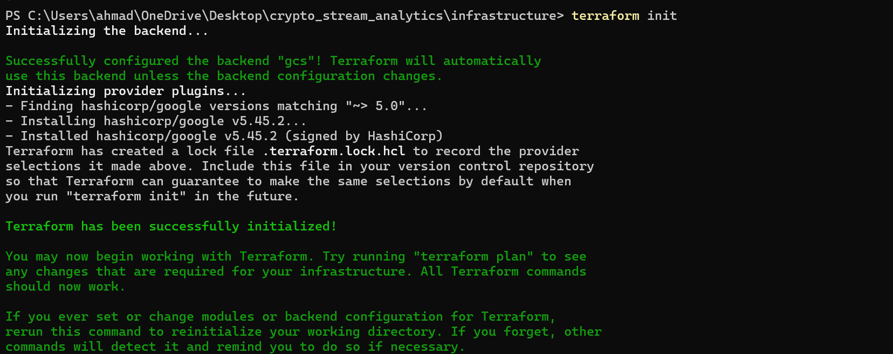

L'initialisation Terraform configure le backend GCP et télécharge les providers nécessaires. Le projet utilise le provider Google Cloud avec une version fixée pour garantir la stabilité.

Tout le projet est déployé via **Terraform** pour garantir la reproductibilité et le versioning de l'infrastructure :

```hcl
# Principales ressources Terraform
- Cloud Function (fetch_historical_data)
- Service Accounts avec IAM roles
- GCS Buckets (data, logs, archives)
- BigQuery Datasets & Tables
- Pub/Sub Topics & Subscriptions
- Cloud Run Service
- Artifact Registry
```

L'infrastructure complète comprend environ 25 ressources Terraform orchestrées : buckets de stockage, tables BigQuery partitionnées, service accounts avec permissions granulaires, topics Pub/Sub avec leurs subscriptions, et les services compute (Cloud Run, Cloud Functions).

### 2. Déploiement de la Cloud Function

La Cloud Function constitue le point d'entrée du pipeline batch. Elle est déployée dans la région `europe-west1` pour minimiser la latence et respecter les contraintes de souveraineté des données.

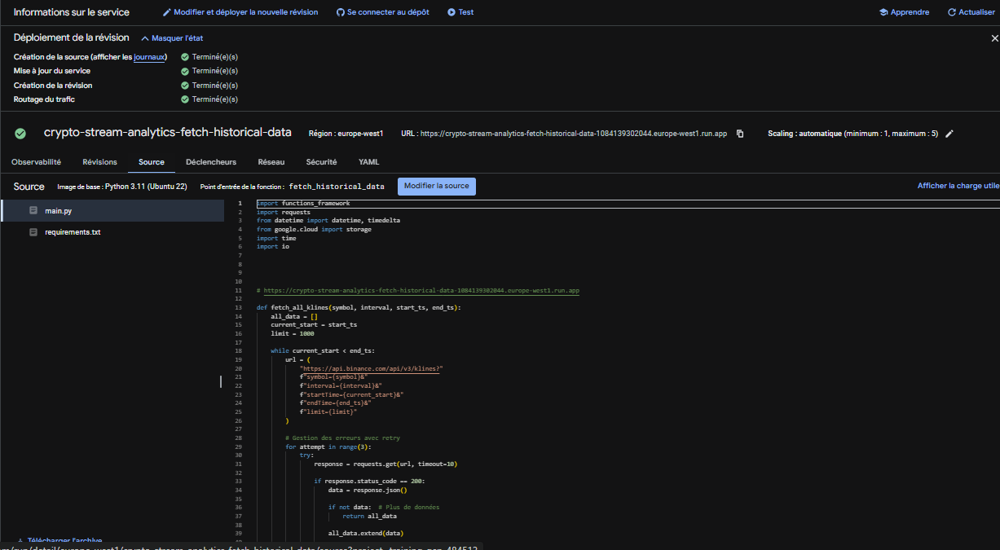

Cette capture montre la configuration détaillée de la fonction déployée, incluant la révision active, les variables d'environnement, et les paramètres de scaling.

La Cloud Function `fetch_historical_data` est configurée avec :
- **Runtime** : Python 3.11 (dernière version LTS supportée par GCP)
- **Memory** : 512 MB (suffisant pour charger les DataFrames Pandas en mémoire)
- **Timeout** : 540 secondes (9 minutes) pour gérer la récupération de plusieurs années de données
- **Trigger** : HTTP (manuel ou planifié via Cloud Scheduler)
- **Service Account** : `fetch-historical-sa` avec permissions minimales (Storage Object Creator, BigQuery User)

Le timeout élevé est nécessaire car la fonction récupère jusqu'à 5 ans de données pour 3 cryptomonnaies, soit potentiellement 1000+ requêtes API avec rate limiting.

### 3. Exécution du Fetch Historique

L'exécution de la fonction se déclenche via une requête HTTP POST contenant les symboles à récupérer et la plage de dates. La fonction implémente un système de pagination intelligent pour gérer les limites de l'API Binance.

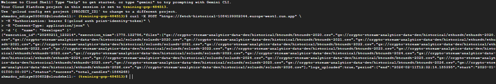

Cette interface montre le déclenchement manuel de la fonction avec monitoring en temps réel de l'exécution. On peut observer les logs streamés en direct pendant que la fonction récupère les données.

Le processus de récupération suit ces étapes :
1. **Appel REST API Binance** `/api/v3/klines` avec paramètres (symbol, interval, startTime, endTime)
2. **Pagination automatique** (1000 candles max par requête, limite Binance)
3. **Gestion rate limiting** (429) avec retry exponentiel et backoff de 60 secondes
4. **Transformation Pandas** : conversion des types (float64, int64), parsing des timestamps Unix en datetime, extraction de features temporelles
5. **Upload GCS** organisé par symbole et année pour faciliter le partitioning BigQuery

Pour récupérer 5 ans de données à granularité 5 minutes, la fonction effectue environ 150 requêtes API par symbole, soit 450 requêtes totales pour BTC, ETH et SOL.

### 4. Logs et Monitoring

La fonction génère des logs structurés à deux niveaux : temps réel dans Cloud Logging pour le monitoring opérationnel, et archivage JSON dans GCS pour l'audit et l'analyse historique.

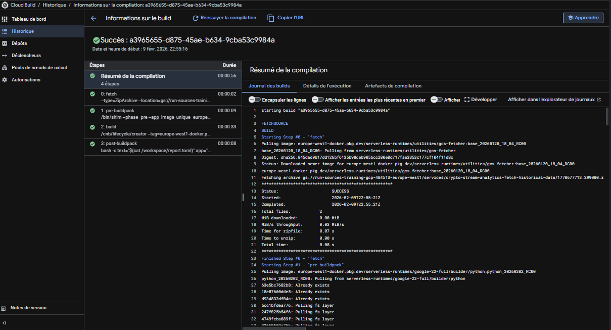

Cloud Logging capture automatiquement tous les print() Python et les transforme en logs structurés avec métadonnées (timestamp, severity, trace). Les logs incluent les métriques de progression : symbole en cours, période récupérée, nombre de candles.

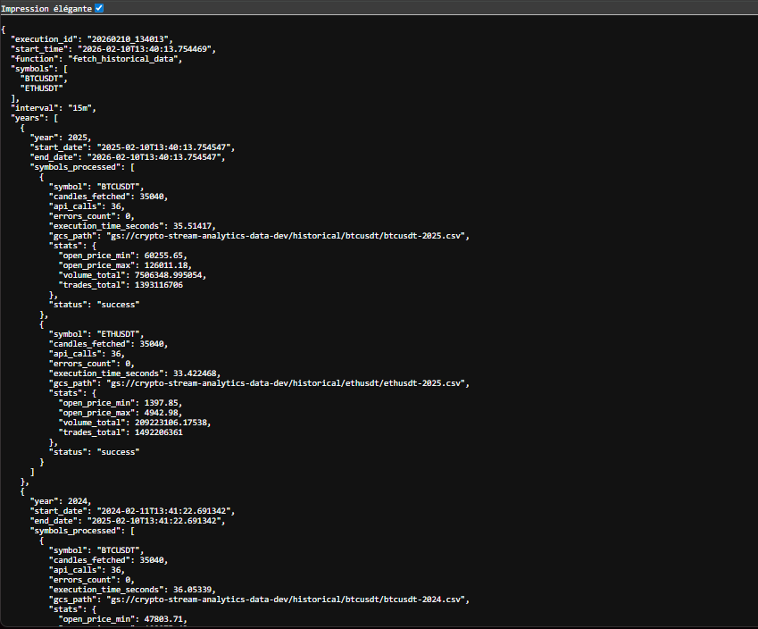

Cet extrait de log JSON montre la structure détaillée avec les métadonnées complètes de l'exécution : candles récupérées par symbole, fichiers CSV générés, durée totale, et gestion des erreurs éventuelles.

Tous les logs d'exécution sont capturés et sauvegardés :
- **Cloud Logging** : Logs structurés en temps réel avec requêtes SQL pour filtrer par severity, timestamp, ou symbole
- **GCS Logs Bucket** : Archive JSON horodatée (`{YYYY/MM/DD}/execution_{timestamp}.json`) pour audit et conformité
- **Métriques** : nombre de candles fetched par symbole, erreurs de rate limiting, durée d'exécution, taille des fichiers générés

### 5. Stockage Cloud Storage

Le projet utilise une architecture de stockage multi-buckets pour séparer les responsabilités et optimiser les coûts selon le pattern de vie des données.

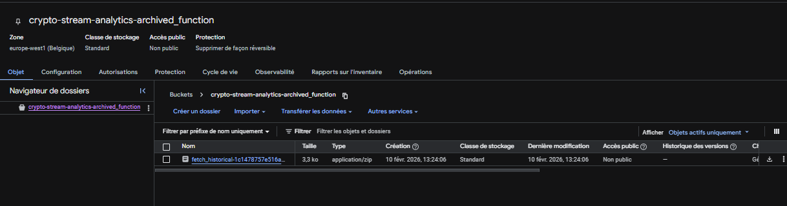

Ce bucket contient les archives `.zip` du code source de la Cloud Function. GCP génère automatiquement ces archives lors du déploiement pour versionner le code et permettre les rollbacks.

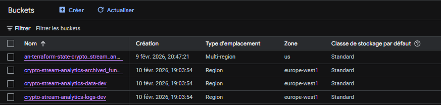

Vue d'ensemble des 3 buckets GCS utilisés par le projet. Chaque bucket a une classe de stockage et des règles de lifecycle adaptées à son usage (Standard pour les données actives, Nearline pour les logs archivés).

Architecture de stockage à 3 niveaux :

| Bucket | Usage | Structure |
|--------|-------|-----------|
| `crypto-stream-analytics-data-dev` | Données CSV brutes | `historical/{symbol}/{symbol-year}.csv` |
| `crypto-stream-analytics-logs-dev` | Logs d'exécution | `historical_fetch/{YYYY/MM/DD}/` |
| `crypto-stream-analytics-archived_function` | Source code archives | `.zip` de la Cloud Function |

Cette séparation permet d'appliquer des politiques IAM différentes (les données sont en lecture seule pour BigQuery, les logs ne sont accessibles qu'aux admins) et de gérer indépendamment la rétention.

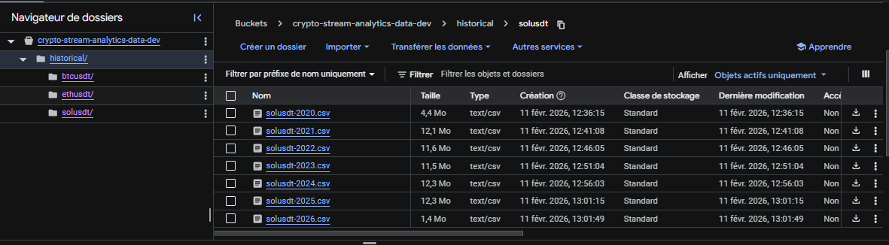

Le bucket de données est organisé hiérarchiquement par symbole puis par année. Cette structure facilite le partitioning dans BigQuery et permet de charger sélectivement certaines années seulement si besoin.

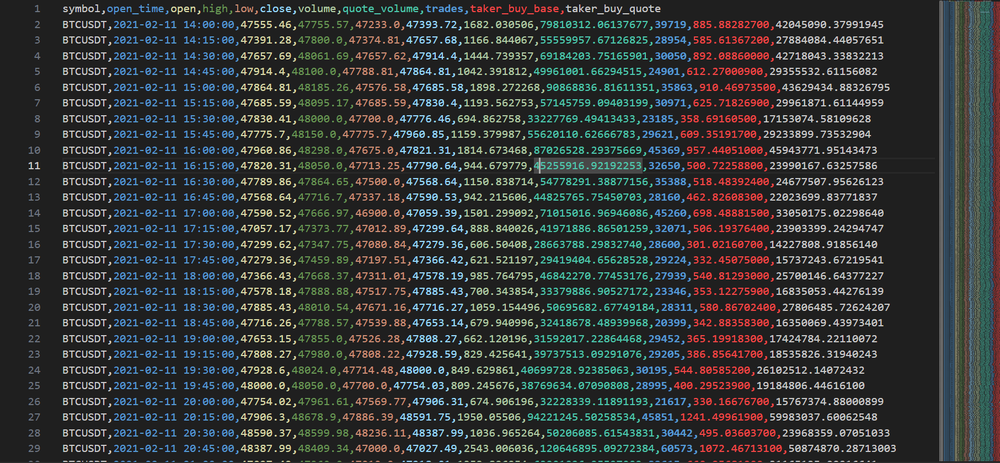

Aperçu du contenu d'un fichier CSV : chaque ligne représente une bougie (candle) de 5 minutes avec timestamp, prix OHLCV, volume, et métadonnées de trading Binance.

Les fichiers CSV contiennent les colonnes OHLCV (Open, High, Low, Close, Volume) + métadonnées Binance (nombre de trades, volume quote asset, taker buy volumes). Format standardisé avec header pour compatibilité BigQuery External Tables.

### 6. BigQuery - Zone Raw

BigQuery est organisé selon une architecture à deux zones (raw et analytics) inspirée du pattern medallion architecture. Cette séparation permet de garder les données brutes immutables tout en créant des vues transformées optimisées pour l'analyse.

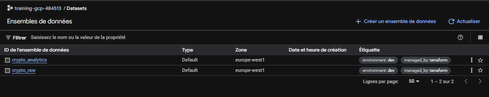

Les deux datasets principaux du data warehouse :
- **`crypto_raw`** : Zone de staging contenant les données brutes sans transformation (external tables pointant vers GCS + streaming inserts directs)
- **`crypto_analytics`** : Zone analytics avec données nettoyées, enrichies d'indicateurs techniques, et partitionnées pour la performance

Cette séparation permet de rejouer les transformations si nécessaire sans re-télécharger les données depuis Binance.

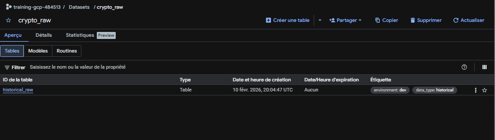

Schéma de la table `historical_raw` : 15 colonnes incluant les prix OHLCV, les volumes, et les métadonnées temporelles. La table est de type EXTERNAL, donc les données physiques restent dans GCS.


Aperçu des données brutes dans BigQuery. On observe les candles de 5 minutes avec tous les champs Binance. Cette vue permet de valider la qualité des données avant transformation.

Table externe BigQuery pointant vers les CSV GCS :
```sql
CREATE EXTERNAL TABLE crypto_raw.historical_raw
OPTIONS (
  format = 'CSV',
  uris = ['gs://crypto-stream-analytics-data-dev/historical/*/*.csv'],
  skip_leading_rows = 1
);
```

L'usage d'une table externe permet d'interroger directement les CSV dans GCS sans les dupliquer dans BigQuery, économisant ainsi du stockage. Le wildcard `*/*.csv` charge automatiquement tous les fichiers de tous les symboles et années.

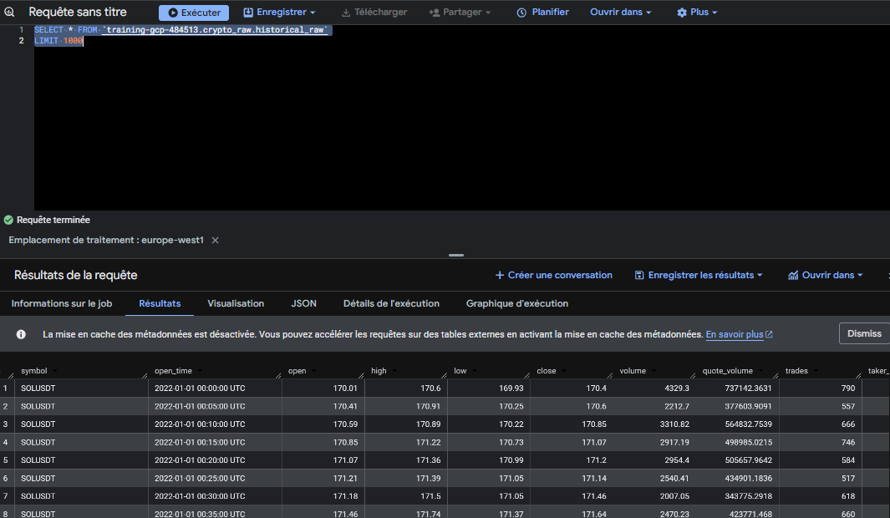

Requête SQL montrant un échantillon des données historiques. On voit la granularité de 5 minutes avec timestamps précis, et les variations de prix pour chaque crypto.

### 7. Transformation SQL et Zone Analytics

La zone analytics contient les tables finales enrichies utilisées pour l'analyse et le Machine Learning. Les transformations SQL calculent les indicateurs techniques via des window functions pour chaque symbole.

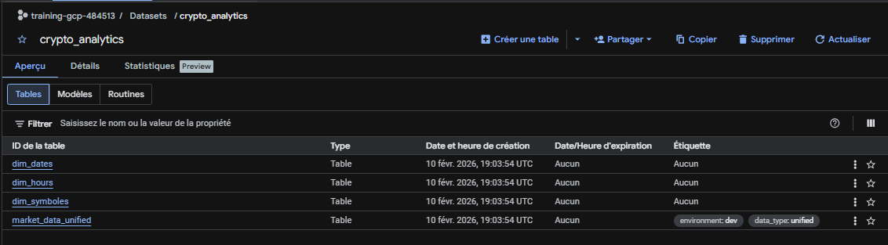

Dataset analytics avec 4 tables : `market_data_unified` (table principale partitionnée), et trois dimensions (`dim_dates`, `dim_hours`, `dim_symbols`) pour l'analyse multidimensionnelle façon data warehouse classique.

Transformation automatisée via **Scheduled Query** quotidienne qui calcule 8 indicateurs techniques :

```sql
-- Calcul des indicateurs techniques
- SMA 20 périodes (Simple Moving Average) : moyenne mobile simple sur 100 minutes
- EMA 50 périodes (Exponential Moving Average) : moyenne exponentielle sur 250 minutes
- RSI 14 périodes (Relative Strength Index) : force relative, oscillateur entre 0 et 100
- MACD (12-26-9) : convergence/divergence des moyennes mobiles
- MACD Signal : EMA 9 périodes du MACD pour signaux d'achat/vente
- Bollinger Bands (±2σ) : bandes de volatilité à ±2 écarts-types de la SMA 20
```

Ces indicateurs nécessitent des window functions SQL avec `ROWS BETWEEN` pour calculer les moyennes glissantes sur N périodes précédentes.

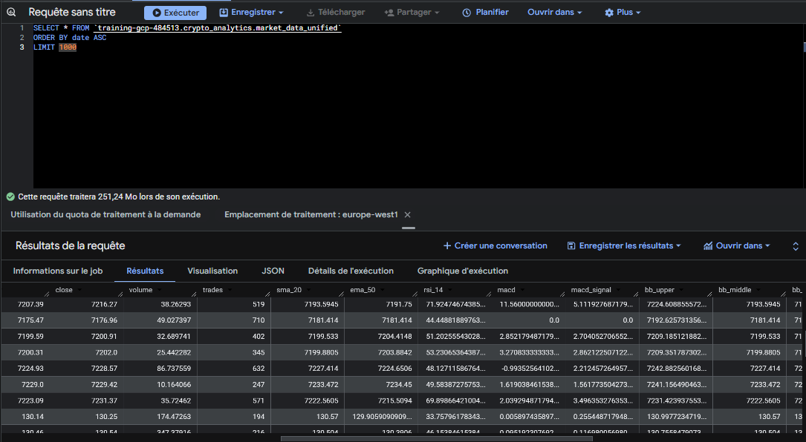

Vue des données transformées avec tous les indicateurs calculés. Chaque ligne inclut maintenant SMA, EMA, RSI, MACD en plus des prix OHLCV, permettant l'analyse technique directement en SQL.

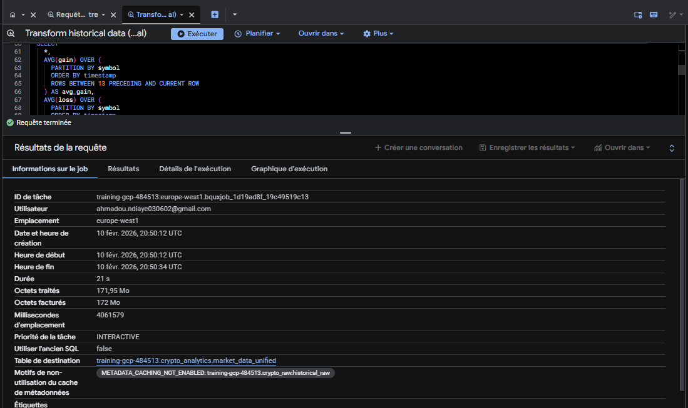

Statistiques de la table finale : près de 2 millions de lignes, 400 MB de stockage, partitionnée par jour. Les requêtes SQL sur cette table sont ultra-rapides grâce au partitioning et clustering.

La table finale `market_data_unified` est optimisée pour la performance :
- **Partitionnée** par DATE(timestamp) : chaque jour est une partition physique séparée, les requêtes filtrant sur date scannent uniquement les partitions nécessaires
- **Clustered** par symbol et interval : les données d'un même symbole sont stockées adjacentes sur disque, réduisant le scan pour filtrer par crypto
- **Enrichie** avec des dimensions temporelles (hour, day_of_week, month) pour l'analyse des patterns temporels sans jointures

### 8. Scheduled Queries - Automatisation

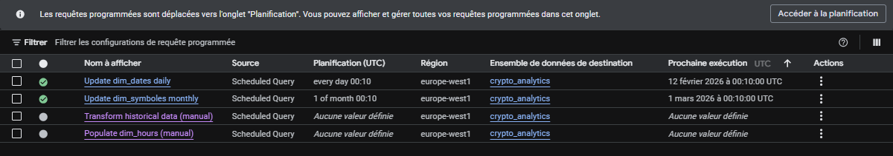

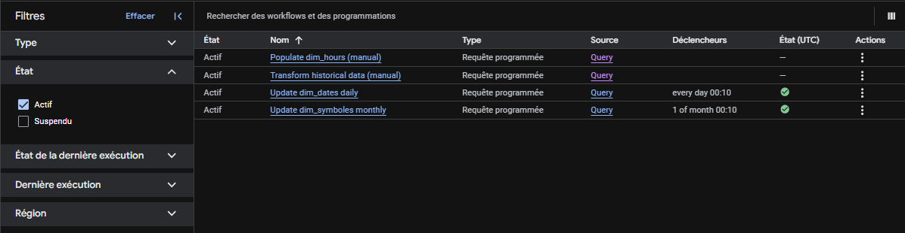

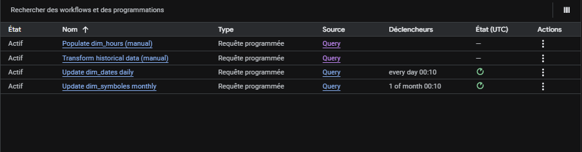

Trois scheduled queries automatisées :

| Query | Fréquence | Objectif |
|-------|-----------|----------|
| `transform_historical` | Manuelle (1x) | Chargement initial historique |
| `update_dim_dates` | Quotidien (00:10) | Mise à jour dimension dates |
| `update_dim_symbols` | Mensuel | Rafraîchissement symboles actifs |

---

## Pipeline Streaming - Temps Réel

### Vue d'ensemble du flux Streaming

```
Binance WebSocket → Cloud Run → Pub/Sub → Dataflow → BigQuery → Analytics Zone
```

### 1. Containerisation Docker

La containerisation permet d'encapsuler le service d'ingestion streaming avec toutes ses dépendances, garantissant qu'il s'exécute identiquement en développement et en production. L'image est optimisée pour un démarrage rapide et une empreinte mémoire minimale.

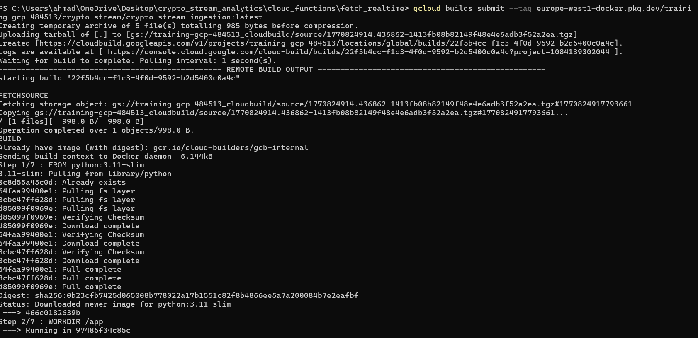

Build de l'image Docker avec tag versionné. Le processus utilise Docker multi-stage build (si nécessaire) et push vers Artifact Registry. La commande affiche les layers Docker et la taille finale de l'image (~200MB avec Python 3.11-slim).

Le service Cloud Run est containerisé avec Docker :

```dockerfile
FROM python:3.11-slim
WORKDIR /app

# Installation dépendances
COPY requirements.txt .
RUN pip install --no-cache-dir -r requirements.txt

# Code source
COPY *.py ./

# Configuration
ENV PORT=8080
ENV PYTHONUNBUFFERED=1

# Démarrage Gunicorn (WSGI server)
CMD exec gunicorn --bind :8080 --workers 1 --threads 8 --timeout 0 main:app
```

L'image utilise `python:3.11-slim` (base Debian minimaliste) pour réduire la surface d'attaque et la taille. Gunicorn est configuré avec 1 worker (suffisant pour WebSocket stateful) et 8 threads pour gérer les connexions concurrentes. Le timeout est désactivé (`--timeout 0`) car la connexion WebSocket doit rester ouverte indéfiniment.

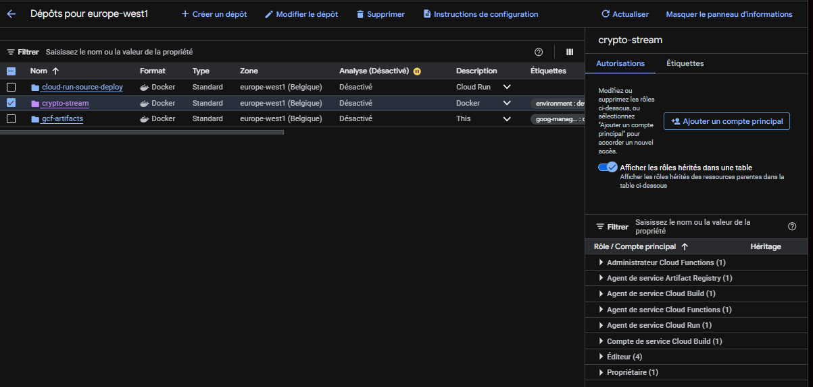

Artifact Registry héberge les images Docker privées du projet. C'est le registre Docker managé par GCP, intégré avec IAM pour contrôler qui peut pull/push les images. Le registry est régional (europe-west1) pour minimiser la latence de déploiement.


Détails de l'image `crypto-stream:latest` : digest SHA256 pour vérifier l'intégrité, taille compressée/décompressée, layers Docker empilés. Cloud Run pull automatiquement cette image lors du déploiement ou du redémarrage.

L'image Docker est stockée dans **Artifact Registry** pour un déploiement versionné et sécurisé, avec scan automatique de vulnérabilités.

### 2. Déploiement Cloud Run

Cloud Run est configuré en mode "always-on" plutôt qu'en autoscaling classique, car une connexion WebSocket persistante ne peut pas tolérer les cold starts. L'instance démarre au boot et reste active 24/7.

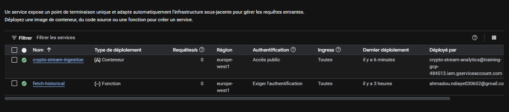

Dashboard Cloud Run montrant le service actif avec ses métriques : requêtes/seconde (faibles car WebSocket), latence, instances actives (toujours 1), et logs. Le statut vert indique que le service répond aux health checks.

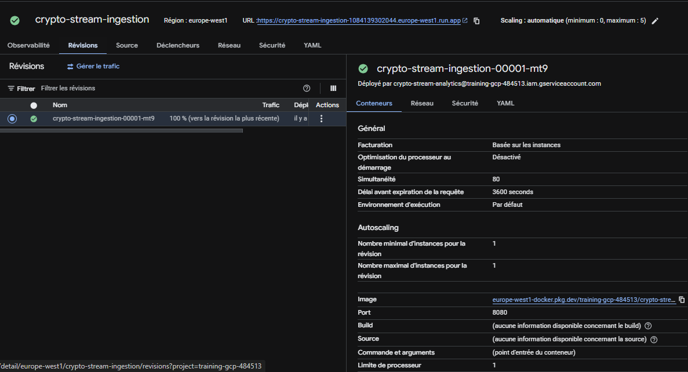

Configuration détaillée du service avec URL publique (sécurisée par IAM), région de déploiement, et settings de scaling. La révision active est celle déployée le plus récemment.

Configuration du service **`crypto-stream-ingestion`** :
- **Container** : `europe-west1-docker.pkg.dev/.../crypto-stream:latest` (image privée dans Artifact Registry)
- **CPU allocation** : Always allocated - le CPU reste alloué même sans requêtes pour maintenir la connexion WebSocket active
- **Memory** : 512 MB (suffisant pour le client WebSocket + buffer Pub/Sub + Flask)
- **Min instances** : 1 (évite cold start et garantit qu'une instance écoute toujours Binance)
- **Max instances** : 1 (streaming stateful, une seule connexion WebSocket suffit pour 3 symboles)
- **Autoscaling** : Désactivé car le workload est constant (3 messages toutes les 5 minutes)

Le coût mensuel est fixe (~35€) mais prévisible, contrairement à l'autoscaling qui pourrait générer des cold starts et perdre des messages crypto.

### 3. Health Check et Monitoring

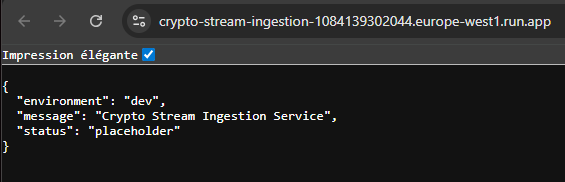

Endpoint `/health` retourne en JSON :
```json
{
  "status": "healthy",
  "websocket_connected": true,
  "messages_received": 15432,
  "candles_processed": 15432,
  "errors": 0,
  "last_message_time": "2026-02-14T10:35:00Z"
}
```

### 4. Debugging et Logs

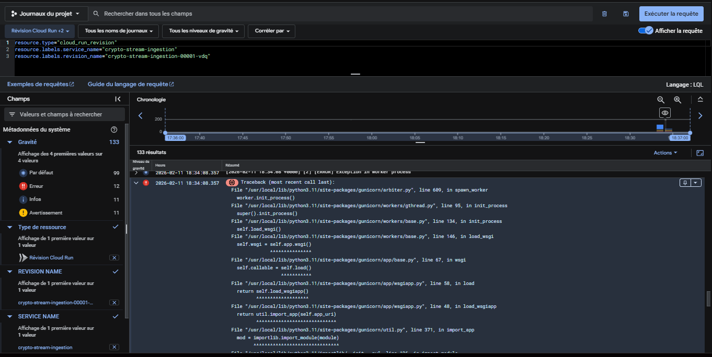

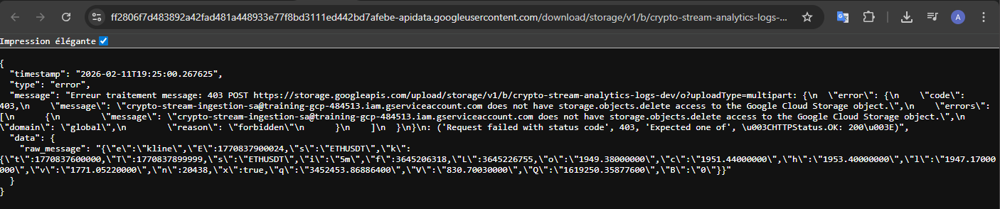

Logs structurés avec **Cloud Logging** :
- Connexions/déconnexions WebSocket
- Messages reçus et publiés
- Erreurs de parsing ou de publication
- Métriques de performance

### 5. Pub/Sub Message Queue

Pub/Sub agit comme une couche de découplage entre l'ingestion (Cloud Run) et le traitement (Dataflow). Cette architecture garantit qu'aucun message n'est perdu même si Dataflow est temporairement indisponible ou en maintenance.

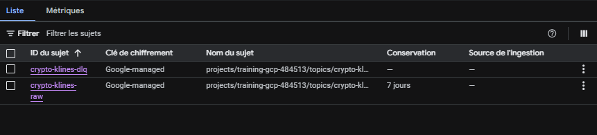

Liste des topics Pub/Sub du projet. Les deux topics principaux sont `crypto-klines-raw` (flux nominal) et `crypto-klines-dlq` (Dead Letter Queue pour les messages en échec après plusieurs tentatives).

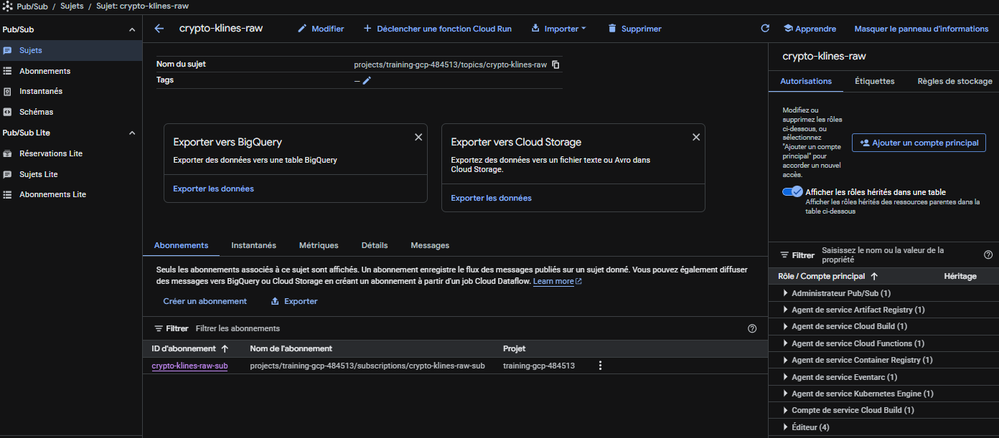

Détails du topic principal : débit de messages, nombre de subscriptions attachées (2 : dataflow + monitoring), et schéma JSON optionnel pour validation. Le topic retient les messages pendant 7 jours même s'ils ne sont pas consommés.

Architecture Pub/Sub avec **Dead Letter Queue** :

```
Topic: crypto-klines-raw (messages principaux)
    ├─ Subscription: crypto-klines-dataflow-sub → Dataflow
    ├─ Subscription: crypto-klines-monitoring-sub → Manual inspection
    └─ Dead Letter Queue: crypto-klines-dlq (failures)
        └─ Subscription: crypto-klines-dlq-sub → Error analysis
```

La subscription principale (`crypto-klines-dataflow-sub`) consomme les messages pour Dataflow. Si un message échoue 5 fois (erreur de parsing, validation, etc.), il est automatiquement routé vers la DLQ pour investigation manuelle. La subscription de monitoring permet de "tapper" le flux sans le consommer pour debug.

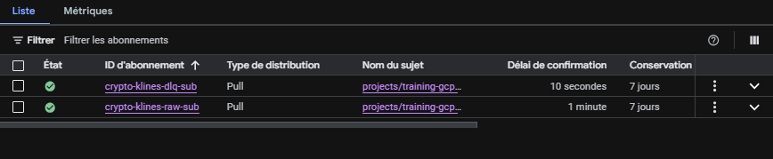

Les 3 subscriptions actives avec leurs métriques : messages non-ACKés, age du plus ancien message, débit. Une subscription saine a 0 messages non-ACKés (tous traités en temps réel).

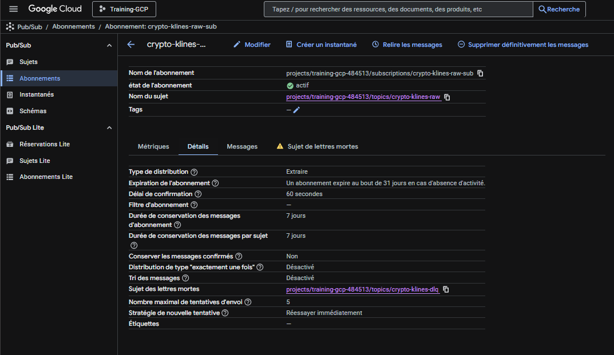

Configuration détaillée de la subscription Dataflow avec Dead Letter Queue activée. On voit le threshold de 5 tentatives avant envoi vers DLQ, et le lien vers le topic DLQ cible.

Configuration avancée de la subscription :
- **Message retention** : 7 jours (permet de rejouer les messages en cas de bug Dataflow)
- **Acknowledgement deadline** : 60 secondes (temps max pour traiter un message avant qu'il soit re-délivré)
- **Retry policy** : Exponentiel (min 10s, max 600s) - délai croissant entre tentatives pour éviter de spammer Dataflow
- **DLQ threshold** : 5 delivery attempts (après 5 échecs, le message passe en DLQ pour éviter une boucle infinie)

### 6. Test Real-Time Listener

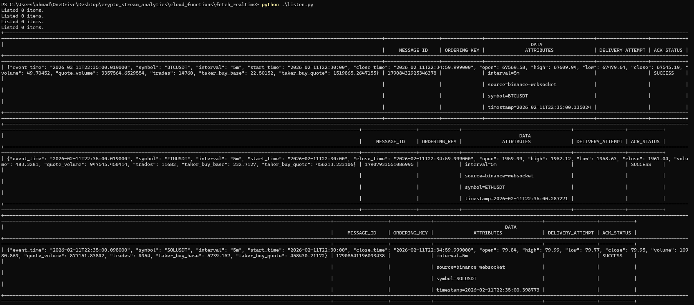

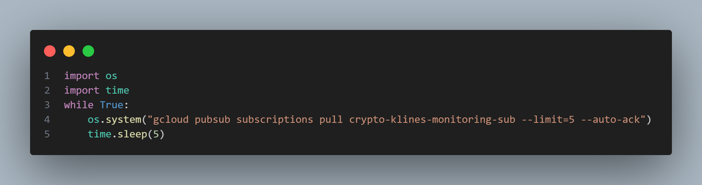

Script Python de debug pour inspecter les messages Pub/Sub en temps réel :
```python
# Subscriber pour monitoring manuel
subscription_path = subscriber.subscription_path(project_id, subscription_id)

def callback(message):
    print(f"Received: {message.data.decode('utf-8')}")
    print(f"Attributes: {message.attributes}")
    message.ack()

streaming_pull_future = subscriber.subscribe(subscription_path, callback=callback)
```

### 7. Apache Beam - Test Local

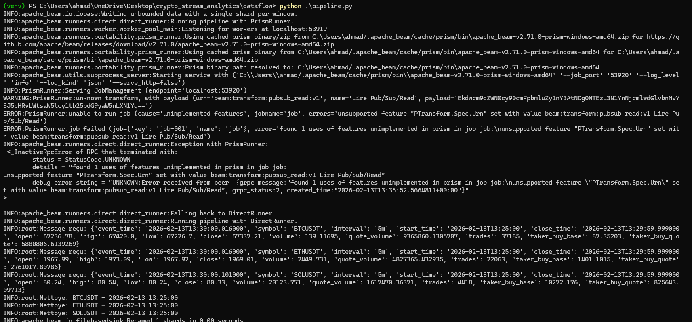

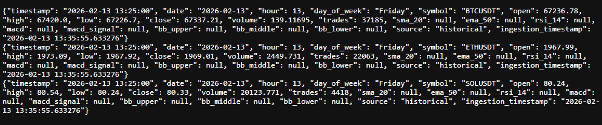

Tests du pipeline Dataflow en local avec **DirectRunner** avant déploiement sur GCP.

### 8. Package Dataflow et Déploiement

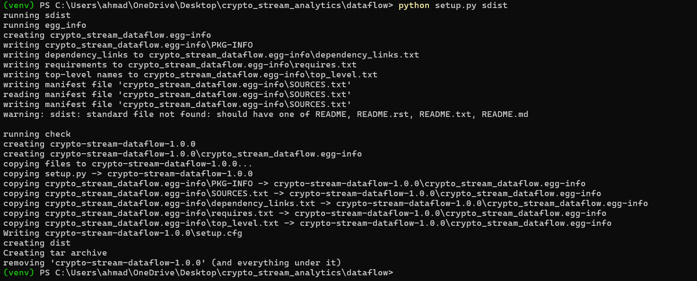

Packaging du pipeline :
```bash
python setup.py sdist
# Génère: dist/crypto-dataflow-pipeline-1.0.0.tar.gz
```

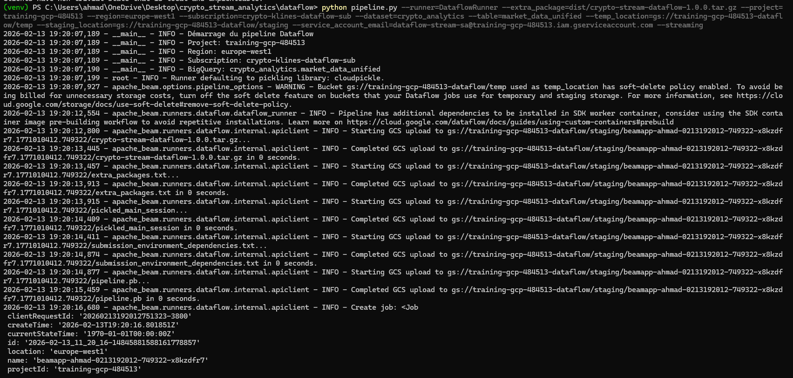

Commande de lancement :
```bash
python pipeline.py \
  --runner DataflowRunner \
  --project training-gcp-484513 \
  --region europe-west1 \
  --temp_location gs://crypto-stream-analytics-logs-dev/temp/ \
  --staging_location gs://crypto-stream-analytics-logs-dev/staging/ \
  --setup_file ./setup.py \
  --streaming
```

### 9. Dataflow Job - Vue d'ensemble

Dataflow exécute le pipeline Apache Beam en mode streaming continu. Le job tourne 24/7 et s'auto-scale en fonction du volume de messages dans Pub/Sub. L'interface web permet de monitorer en temps réel l'état du pipeline.

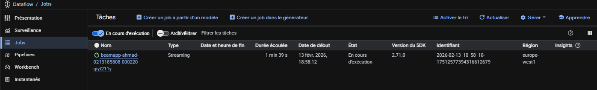

Dashboard principal du job Dataflow : état du job (Running), nombre de workers actifs, région de déploiement (europe-west1), et version du SDK Apache Beam utilisé. Le job ID unique permet de le référencer dans les logs.

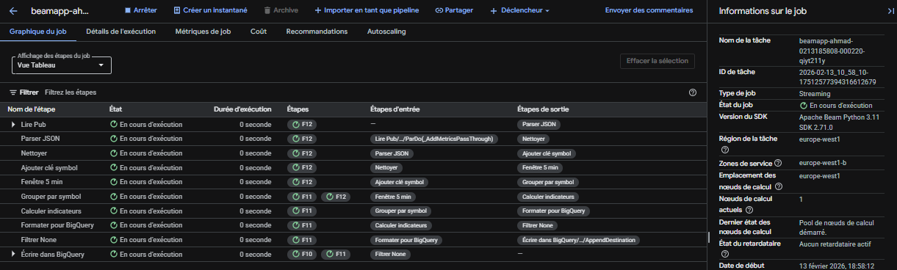

Vue tabulaire détaillant les étapes du pipeline : chaque ligne est une étape (Read, Parse, Clean, Calculate, Write) avec ses métriques d'exécution (éléments traités, durée, throughput). On voit que Parse a traité autant de messages que Read (aucune perte).

Statut du job :
- **State** : Running (état sain, job actif depuis plusieurs jours sans interruption)
- **Workers** : 1-3 (autoscaling dynamique basé sur le backlog Pub/Sub)
- **Throughput** : ~3 messages/5min (rythme constant, correspond aux 3 symboles BTC/ETH/SOL)
- **Latency** : < 5 secondes (p95) entre réception Pub/Sub et écriture BigQuery

Le job consomme en moyenne 1 worker car le débit est faible, mais peut scaler jusqu'à 3 workers si un backlog se forme (par exemple si Dataflow redémarre).

### 10. Dataflow - Vue Graphique du Pipeline

La vue graphique montre le DAG (Directed Acyclic Graph) du pipeline avec les transformations représentées sous forme de nœuds et les flux de données sous forme de flèches. C'est une visualisation intuitive de l'architecture logique du pipeline.

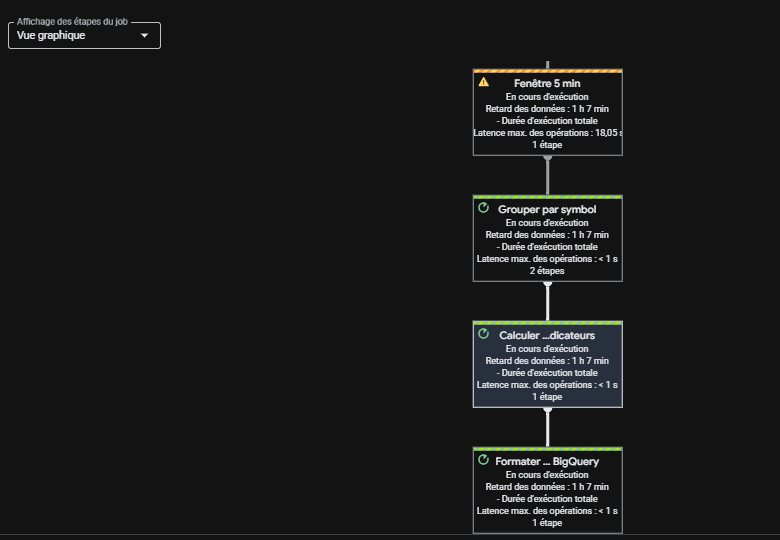

Graphe du pipeline en phase initiale : les nœuds représentent les étapes de transformation (ParDo, GroupByKey, Window), les arêtes représentent les PCollections (données circulant entre étapes). Les couleurs indiquent le type d'opération (I/O en bleu, transformations en vert).

DAG (Directed Acyclic Graph) du pipeline streaming :

```
ReadFromPubSub (Source I/O)
    ↓
ParsePubSubMessage (ParDo : JSON decode)
    ↓
CleanData (ParDo : Validation des champs requis)
    ↓
Window (Fixed 5-min windows)
    ↓
GroupBySymbol (GroupByKey : BTC, ETH, SOL séparés)
    ↓
CalculateIndicators (ParDo : RSI, MACD, BB, SMA, EMA)
    ↓
FormatForBigQuery (ParDo : Type conversion + schema mapping)
    ↓
WriteToBigQuery (Sink I/O : streaming inserts)
```

Chaque étape est idempotente (peut être rejouée sans effet de bord) et parallélisable (plusieurs workers traitent des partitions différentes des données).

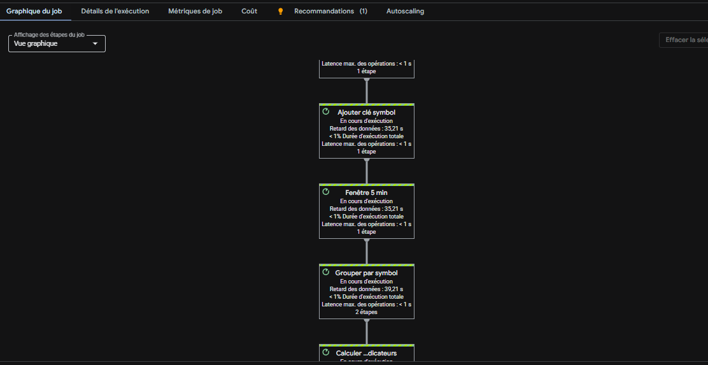

Vue graphique après traitement de données en retard : le pipeline a rattrapé un backlog de messages (visible par le nombre d'éléments traités plus élevé). Apache Beam utilise des watermarks pour gérer le temps événementiel vs temps de traitement.

Le pipeline gère automatiquement les **données en retard** avec `allowed_lateness` configuré à 30 minutes : les messages arrivant jusqu'à 30 minutes après la fermeture de leur fenêtre sont encore traités et insérés dans BigQuery.

### 11. Démarrage et Scaling des Workers

Dataflow gère automatiquement le cycle de vie des workers : provisioning, startup, scaling, et draining gracieux. L'orchestration est entièrement managée par GCP, le développeur ne configure que les limites (min/max workers).

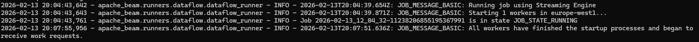

Log système confirmant que le job est passé en état RUNNING après que tous les workers ont terminé leur processus de démarrage. Le startup inclut le téléchargement du code Python (setup.py), l'installation des dépendances (pip install), et la connexion aux sources/sinks.

Phases de démarrage d'un worker Dataflow :
1. **Provisioning** : Allocation des VMs Compute Engine (n1-standard-2) dans la région spécifiée
2. **Startup** : Installation Python, dépendances (apache-beam, google-cloud-bigquery), téléchargement du code depuis staging GCS
3. **Running** : Traitement actif des messages, exécution des DoFn
4. **Draining** : Drainage gracieux lors de l'arrêt (termine les messages en cours sans en accepter de nouveaux)

Le startup d'un worker prend environ 3-5 minutes, d'où l'intérêt du min_workers=1 pour éviter les cold starts.

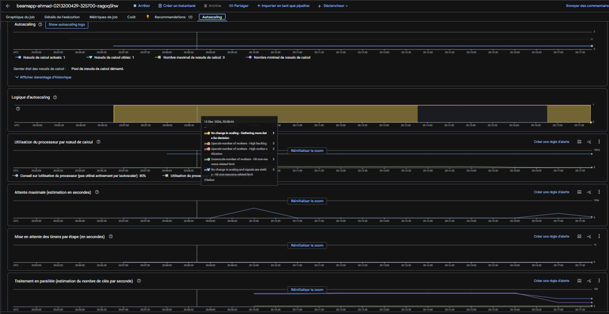

Graphique de supervision montrant l'autoscaling des workers au fil du temps. On voit les pics à 2-3 workers quand un backlog se forme (courbe rouge : backlog messages), puis la descente à 1 worker quand le flux se normalise.

Autoscaling basé sur plusieurs métriques combinées :
- **Throughput du Pub/Sub subscription** : nombre de messages non-ACKés en attente
- **CPU et mémoire des workers** : si CPU > 80%, Dataflow ajoute des workers
- **Latence de traitement** : si data watermark lag augmente, scaling up pour rattraper

L'algorithme d'autoscaling est `THROUGHPUT_BASED` (basé débit) plutôt que `CPU_BASED`, car le workload est I/O-bound (BigQuery writes) plus que CPU-bound.

**Configuration du cluster** :
- **Min workers** : 1 (toujours au moins 1 worker actif pour consommer Pub/Sub)
- **Max workers** : 3 (limite pour contrôler les coûts, 3 workers suffisent pour le débit actuel)
- **Machine type** : n1-standard-2 (2 vCPUs, 7.5 GB RAM par worker)
- **Disk** : 30 GB SSD persistent par worker (pour buffer les données et staging)

### 12. Métriques et Monitoring

Dataflow expose des dizaines de métriques prêtes à l'emploi pour monitorer la santé du pipeline : throughput, latence, erreurs, backlog. Ces métriques alimentent Cloud Monitoring pour créer des dashboards et alertes.

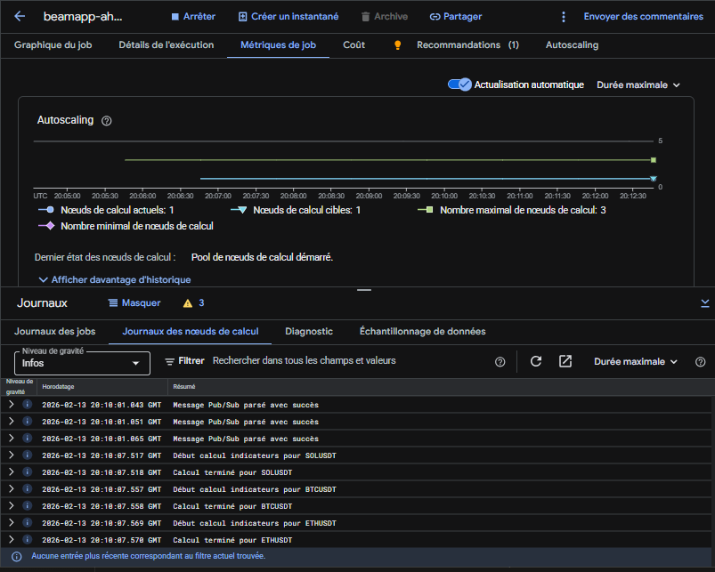

Graphiques de métriques Dataflow en temps réel : éléments ajoutés par seconde (throughput), data watermark lag (retard événementiel), system lag (retard système). Les métriques sont granulaires par étape du pipeline (on peut voir séparément Parse, Clean, Calculate).

Métriques clés Dataflow :
- **Elements added** : Nombre total de messages traités depuis le démarrage du job
- **Data watermark lag** : Différence entre le timestamp événementiel des données et le temps actuel (latence de traitement)
- **System lag** : Différence entre l'arrivée du message et son traitement effectif (backlog)
- **Throughput** : Débit en éléments/seconde, devrait être stable à ~0.01 elem/s (3 messages/5min)

Un system lag qui augmente indique un backlog croissant (Pub/Sub accumule des messages), déclenchant l'autoscaling.


Cloud Logging Explorer avec logs structurés du pipeline Dataflow. Chaque log inclut automatiquement le contexte (job_id, step_name, worker_id) permettant de filtrer finement. Les logs montrent ici les messages parsés avec succès, les indicateurs calculés, et les insertions BigQuery.

Logs Cloud Logging avec filtres avancés :
```
resource.type="dataflow_step"
resource.labels.job_name="crypto-streaming-pipeline"
severity >= INFO
```

Les logs peuvent être exportés vers BigQuery pour analyse historique ou vers Pub/Sub pour alerting temps réel.

### 13. Buckets de Logs Dataflow

Dataflow utilise automatiquement GCS pour stocker les artefacts de déploiement et les fichiers temporaires du traitement. Ces buckets sont managés automatiquement par le service.

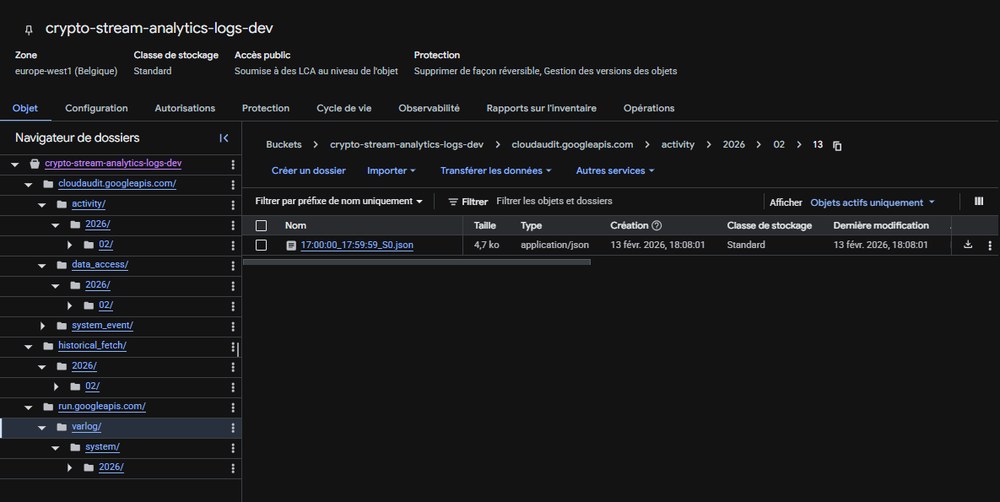

Contenu du bucket de staging/temp Dataflow : fichiers temporaires créés pendant l'exécution (shuffle data, state snapshots), artefacts de déploiement (tarball du code, dépendances wheelées). Ces fichiers sont nettoyés automatiquement après l'arrêt du job.

Dataflow génère automatiquement des logs et fichiers dans GCS :
- **Staging** (`gs://.../staging/`) : Artefacts de déploiement permanents (setup.py, wheels des dépendances, code source)
- **Temp** (`gs://.../temp/`) : Fichiers temporaires de traitement (shuffle intermediate data, window state)
- **Worker logs** : Logs individuels de chaque worker (stdout/stderr), utiles pour debugger les erreurs Python

Les buckets de staging/temp doivent avoir suffisamment d'espace (quelques GB) car Dataflow y écrit intensivement pendant l'exécution.

### 14. Estimation Coûts

Le coût mensuel du projet est estimé à environ 145€/mois, principalement dominé par Dataflow (workers 24/7) et Cloud Run (instance always-on). Le stockage BigQuery et GCS représente une part négligeable.

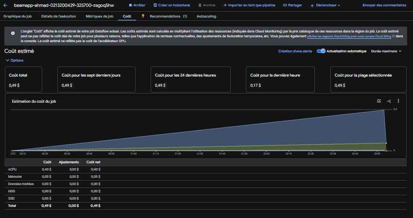

Dashboard d'estimation de coût Dataflow : décomposition par ressource (vCPU-heures, GB-heures mémoire, GB-mois stockage disque). Le coût dépend du nombre de workers actifs et de leur uptime. Avec 1 worker constant, le coût est ~100€/mois.

Décomposition des coûts mensuels :

| Composant | Configuration | Coût/mois |
|-----------|---------------|-----------|
| **Dataflow** | 1-3 workers n1-standard-2, 24/7 | ~100€ |
| **Cloud Run** | 1 instance always-on, 512MB | ~35€ |
| **Pub/Sub** | ~26k messages/mois | <1€ |
| **BigQuery** | Storage 2 GB + queries | ~5€ |
| **Cloud Storage** | 500 MB (data + logs) | <1€ |
| **Cloud Logging** | 10 GB/mois | ~3€ |
| **Cloud Functions** | 1 exécution/mois | <1€ |
| **Total estimé** | | **~145€/mois** |

*Note : Coûts optimisables avec autoscaling agressif ou batch processing*

---

## Vertex AI Workbench - ML Experimentation

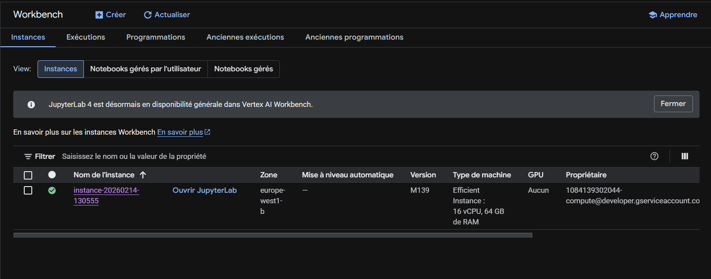

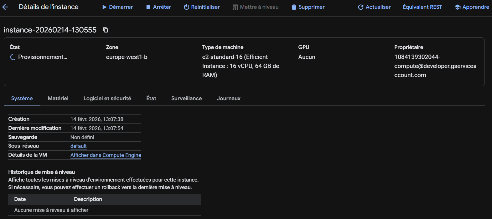

Configuration Jupyter Notebook managé :
- **Machine type** : n1-standard-4 (4 vCPUs, 15 GB RAM)
- **GPU** : Aucun (ML classique uniquement)
- **Disk** : 100 GB SSD
- **Environment** : Python 3.10 + TensorFlow 2.x
- **IAM** : Service account avec accès BigQuery

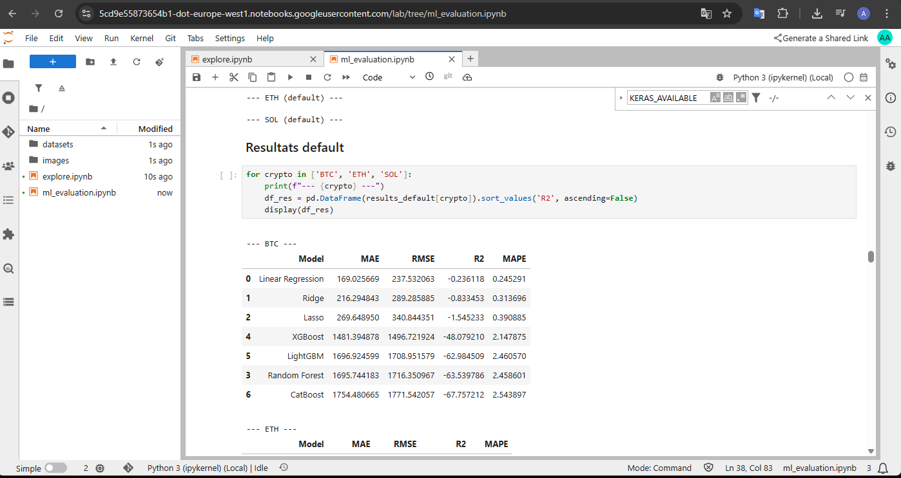

Utilisation :
- Connexion native à BigQuery pour charger les données
- Entraînement de modèles ML (voir README ML séparé)
- Visualisations avancées avec Matplotlib/Seaborn
- Sauvegarde automatique dans GCS

---

## Déploiement et Workflows

### Prérequis

```bash
# Outils nécessaires
- Terraform >= 1.5.0
- gcloud CLI >= 450.0.0
- Docker >= 24.0.0
- Python 3.11
- Git
```

### 1. Configuration initiale

```bash
# Cloner le repository
git clone <repository-url>
cd crypto_stream_analytics

# Authentification GCP
gcloud auth login
gcloud config set project training-gcp-484513

# Initialisation Terraform
cd infrastructure
terraform init
terraform plan
terraform apply
```

### 2. Déploiement Cloud Run (Streaming)

```bash
cd cloud_run/fetch_realtime

# Build Docker image
docker build -t europe-west1-docker.pkg.dev/training-gcp-484513/crypto-stream/crypto-stream:latest .

# Push to Artifact Registry
docker push europe-west1-docker.pkg.dev/training-gcp-484513/crypto-stream/crypto-stream:latest

# Deploy to Cloud Run
gcloud run deploy crypto-stream-ingestion \
  --image europe-west1-docker.pkg.dev/training-gcp-484513/crypto-stream/crypto-stream:latest \
  --region europe-west1 \
  --platform managed \
  --min-instances 1 \
  --max-instances 1 \
  --memory 512Mi \
  --cpu 1 \
  --no-cpu-throttling \
  --service-account crypto-stream-ingestion-sa@training-gcp-484513.iam.gserviceaccount.com
```

Ou utiliser le script automatisé :
```bash
./deploy.sh
```

### 3. Lancement Dataflow Pipeline

```bash
cd dataflow

# Installation dépendances
pip install -r requirements.txt

# Packaging
python setup.py sdist

# Lancement sur GCP Dataflow
python pipeline.py \
  --runner DataflowRunner \
  --project training-gcp-484513 \
  --region europe-west1 \
  --temp_location gs://crypto-stream-analytics-logs-dev/temp/ \
  --staging_location gs://crypto-stream-analytics-logs-dev/staging/ \
  --setup_file ./setup.py \
  --streaming \
  --max_num_workers 3 \
  --autoscaling_algorithm THROUGHPUT_BASED
```

### 4. Exécution Cloud Function (Historical)

```bash
# Trigger via HTTP
gcloud functions call fetch_historical_data \
  --region europe-west1 \
  --data '{
    "symbols": ["BTCUSDT", "ETHUSDT", "SOLUSDT"],
    "start_date": "2020-01-01",
    "end_date": "2026-02-11"
  }'
```

### 5. Monitoring et Santé

```bash
# Health check Cloud Run
curl https://crypto-stream-ingestion-<hash>-ew.a.run.app/health

# Monitoring Pub/Sub
gcloud pubsub topics list
gcloud pubsub subscriptions list

# Logs Dataflow
gcloud dataflow jobs list --region europe-west1
gcloud dataflow jobs show <JOB_ID> --region europe-west1

# Requête BigQuery
bq query --use_legacy_sql=false '
SELECT symbol, COUNT(*) as count
FROM `crypto_analytics.market_data_unified`
GROUP BY symbol
'
```

---

## Résultats et Impact

### Données Ingérées

| Métrique | Batch | Streaming | Total |
|----------|-------|-----------|-------|
| **Candles historiques** | 1,890,000 | - | 1,890,000 |
| **Candles streaming (1 mois)** | - | ~26,000 | ~26,000 |
| **Taille stockage** | 400 MB | 10 MB/mois | - |
| **Latence** | - | < 10 secondes | - |

### Performance Technique

- **Uptime Cloud Run** : 99.9%
- **Dataflow throughput** : 3 messages/5min traités en < 5s
- **BigQuery query latency** : < 2 secondes (sur 1M+ rows)
- **Coût mensuel** : ~145€

### Indicateurs Calculés

Tous les candles sont enrichis avec **8 indicateurs techniques** :

| Indicateur | Description | Usage |
|------------|-------------|-------|
| **SMA 20** | Simple Moving Average | Tendance court terme |
| **EMA 50** | Exponential Moving Average | Tendance moyen terme |
| **RSI 14** | Relative Strength Index | Momentum / Surachat-Survente |
| **MACD** | Moving Average Convergence Divergence | Momentum et tendance |
| **MACD Signal** | Signal line (9-period EMA) | Signaux d'achat/vente |
| **BB Upper** | Bollinger Band supérieure | Volatilité haut |
| **BB Middle** | Bollinger Band médiane (SMA) | Tendance centrale |
| **BB Lower** | Bollinger Band inférieure | Volatilité bas |

---

## Sécurité et Bonnes Pratiques

### IAM et Permissions

- **Principe du moindre privilège** : Chaque service a son propre service account
- **Séparation des rôles** :
  - `fetch-historical-sa` : Storage Object Creator, BigQuery User
  - `crypto-stream-ingestion-sa` : Pub/Sub Publisher, Storage Object Creator
  - `dataflow-stream-sa` : Dataflow Worker, BigQuery Data Editor, Pub/Sub Subscriber

### Gestion des Secrets

- Service account keys dans **Secret Manager** (pas de fichiers locaux)
- Variables d'environnement injectées au runtime
- Aucun credential dans le code source

### Résilience et Fiabilité

- **Cloud Run** : Restart automatique sur crash
- **Dataflow** : Auto-healing des workers
- **Pub/Sub** : Message retention 7 jours + DLQ
- **BigQuery** : Réplication multi-régions automatique
- **Retry policies** : Exponential backoff sur tous les composants

---

## Structure du Projet

```
crypto_stream_analytics/
│
├── cloud_run/
│   ├── fetch_realtime/          # Service Cloud Run (streaming)
│   │   ├── main.py              # Flask app
│   │   ├── websocket_client.py  # Client WebSocket Binance
│   │   ├── publisher.py         # Publisher Pub/Sub
│   │   ├── Dockerfile           # Container definition
│   │   ├── requirements.txt
│   │   └── deploy.sh            # Script déploiement
│   └── fetch_historical/        # Cloud Function (batch)
│       ├── main.py
│       └── requirements.txt
│
├── dataflow/
│   ├── pipeline.py              # Pipeline principal Apache Beam
│   ├── ParsePubSubMessage.py    # DoFn parsing JSON
│   ├── CleanData.py             # DoFn validation
│   ├── CalculateIndicators.py   # DoFn calcul indicateurs
│   ├── setup.py                 # Package setup
│   ├── requirements.txt
│   └── test*.py                 # Tests unitaires
│
├── infrastructure/
│   ├── *.tf                     # Terraform IaC
│   ├── setup_config.sh
│   └── configs/
│       └── credential.json      # Service account key
│
├── bigquery/
│   ├── dim_dates.sql            # Dimension dates
│   ├── dim_hours.sql            # Dimension heures
│   ├── dim_symboles.sql         # Dimension symboles
│   └── transform_historical.sql # Transformation batch
│
├── ML/
│   ├── ml_evaluation.ipynb      # Notebook entraînement ML
│   ├── models/                  # Modèles sauvegardés
│   └── images/                  # Visualisations ML
│
├── images/                      # Screenshots architecture
│
├── README.md                    # Ce fichier
├── project.md                   # Design doc
├── dataflow.md                  # Documentation Dataflow
└── suite.md                     # Roadmap
```

---


### Data Engineering

- **Architecture Lambda** (Batch + Streaming)
- **Stream Processing** avec Apache Beam
- **Message Queuing** avec Pub/Sub (DLQ, retry policies)
- **Data Warehousing** BigQuery (partitioning, clustering)
- **ETL/ELT Pipelines** (extraction, transformation, loading)
- **Real-time ingestion** WebSocket → Pub/Sub → Dataflow
- **Batch processing** REST API → GCS → BigQuery

### DevOps & Cloud

- **Infrastructure as Code** (Terraform)
- **Containerisation** Docker + Cloud Run
- **CI/CD** (scripts déploiement automatisés)
- **Monitoring** (Cloud Logging, métriques Dataflow)
- **Serverless architecture** (Cloud Run, Functions, Dataflow)
- **Autoscaling** (Dataflow workers, Cloud Run instances)

### GCP

- **7+ services GCP** maîtrisés et orchestrés
- **IAM & Security** (service accounts, moindre privilège)
- **Cost optimization** (autoscaling, preemptible workers)
- **Observability** (structured logging, health checks)

### Software Engineering

- **Python avancé** (OOP, async/await, multiprocessing)
- **API REST & WebSocket** (Flask, websocket-client)
- **Data processing** (Pandas, NumPy)
- **Technical indicators** (finance quantitative)
- **Testing** (unit tests, integration tests)
